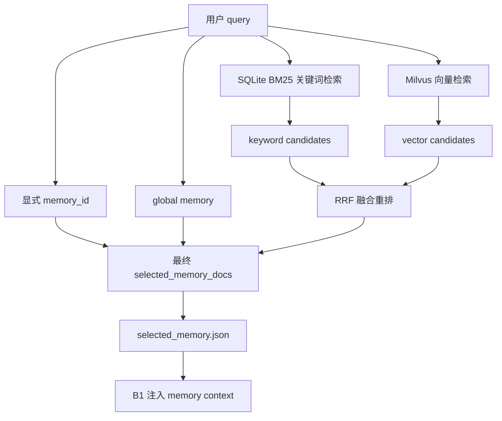
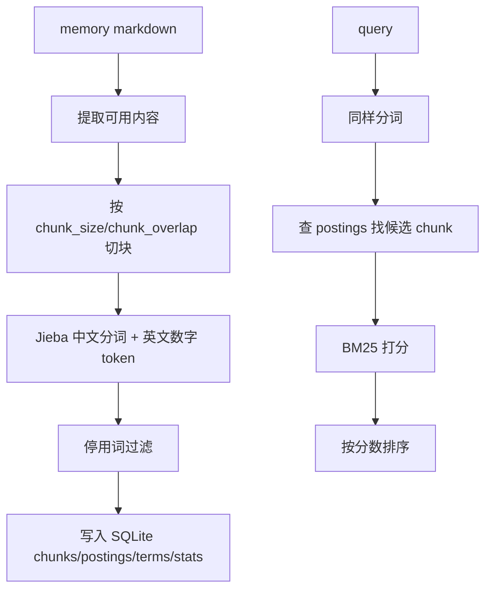
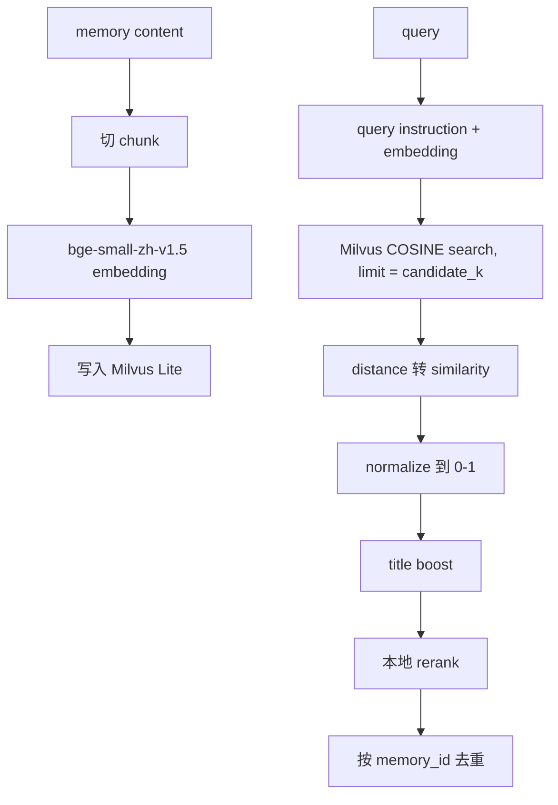
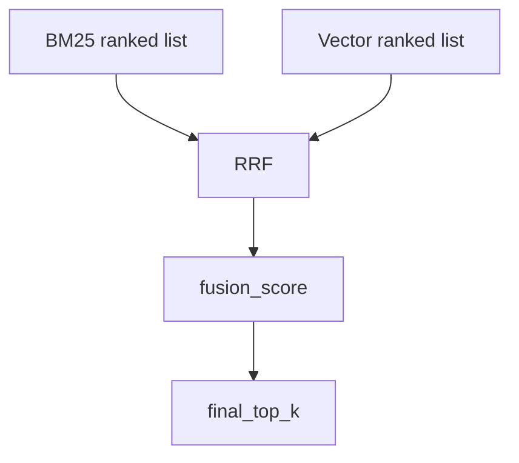
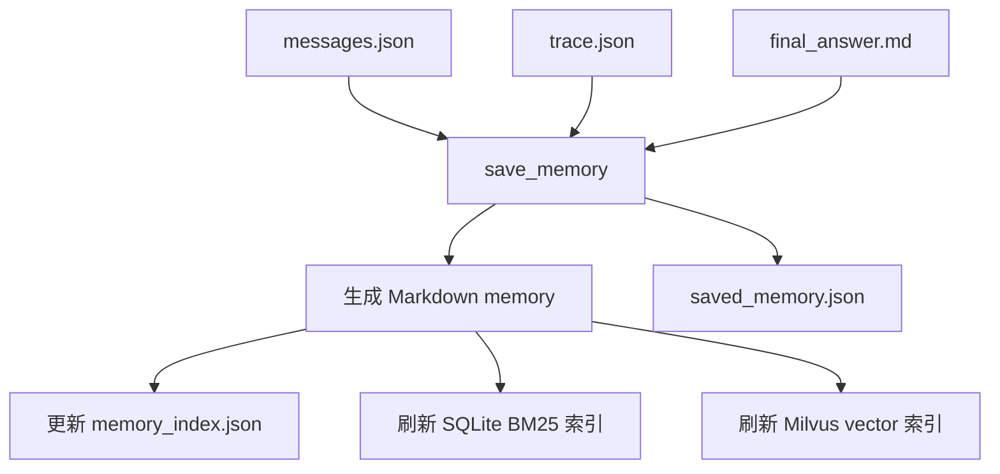
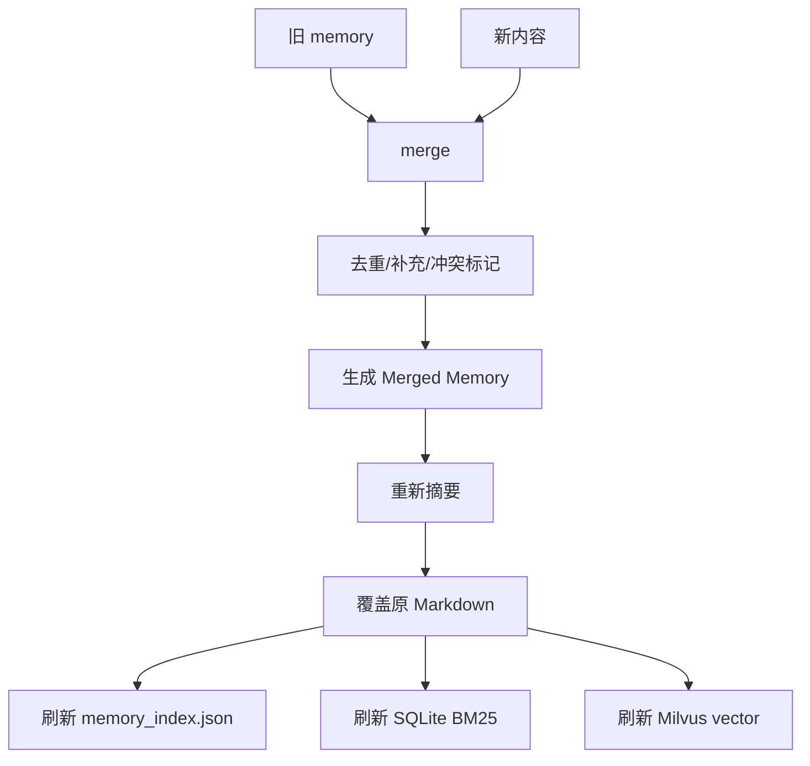

# B5 Memory 模块 README

本文档说明当前项目中 B5 记忆模块的功能、检索流程、保存/更新流程、配置项、命令行测试方式，以及输出文件应该怎么看。

B5 的核心职责是：把 Agent 运行过程沉淀为本地记忆，并在后续任务开始前，根据显式指定、全局记忆、关键词检索和向量检索，选择合适的记忆返回给 B1。

## 1. 模块定位

B5 位于：

```text
code/b5_memory.py
```

主要对外提供三个能力：

| 能力 | 函数 | CLI 输出 |
|---|---|---|
| 选择记忆 | `load_memory(...)` | `selected_memory.json` |
| 保存记忆 | `save_memory(...)` | `saved_memory.json` |
| 更新记忆 | `update_memory(...)` | `updated_memory.json` |

B1 调用 B5 的位置在：

```text
code/b1_agent_runtime.py
```

B1 在任务开始时调用 B5 选择记忆，把返回的记忆内容注入 system context；任务结束后，再调用 B5 保存本轮 conversation memory。

## 2. 当前实现总览

当前 B5 使用混合检索：



其中：

- 关键词检索：`Jieba + SQLite inverted index + BM25`
- 向量检索：`Milvus Lite + bge-small-zh-v1.5 embedding + COSINE`
- 融合排序：`RRF`
- 默认 chunk：`chunk_size = 200`，`chunk_overlap = 30`
- 默认返回数量：关键词 top 3、向量 top 3、融合后 final top 3

## 3. 目录与文件

### 3.1 记忆文件

默认记忆根目录来自：

```yaml
memory:
  root_dir: ../memory
```

实际文件结构大致是：

```text
memory/
  memory_index.json
  keyword_bm25.sqlite
  milvus_memory.db/
  global/
    mem_course_001.md
  conversations/
    conv_000.md
```

含义：

| 文件/目录 | 作用 |
|---|---|
| `memory/memory_index.json` | memory_id 到 markdown 文件路径、标题、摘要等元信息的索引 |
| `memory/global/` | 全局记忆，通常保存课程背景、长期规则、项目说明 |
| `memory/conversations/` | 对话记忆，通常由 B1 每轮任务结束后生成 |
| `memory/keyword_bm25.sqlite` | B5 自建关键词倒排索引 |
| `memory/milvus_memory.db/` | Milvus Lite 向量库 |

### 3.2 Markdown 记忆内容

保存 conversation memory 时，B5 会生成类似结构：

````markdown
# Conversation conv_xxx

## Memory Summary

...

## Summary Metadata

...

## Final Answer

...

## Messages

```json
[
  {"role": "user", "content": "..."},
  {"role": "assistant", "content": "..."}
]
```

## Trace

```json
...
```
````

注意：Markdown 里可以保留 `Trace`，但检索时不会优先把 trace 当成主要语义内容。

B5 真正用于检索的内容由 `_memory_content_for_use(...)` 决定，优先级是：

1. `Merged Memory`
2. `Memory Summary`
3. conversation memory 的 `Messages`
4. raw markdown

其中 conversation messages 会通过 `_messages_to_memory_text(...)` 提取，只保留：

- `role = user`
- `role = assistant`

不会把 `role = system` 的 system prompt 当成语义记忆内容。

## 4. 配置说明

配置文件：

```text
configs/memory.yaml
```

当前关键配置：

```yaml
keyword_memory:
  enabled: true
  backend: sqlite_bm25
  index_path: keyword_bm25.sqlite
  stopwords_path: ../memory/stopwords_baidu.txt
  userdict_path:
  top_k: 3
  candidate_k: 20
  chunk_size: 200
  chunk_overlap: 30
  bm25_k1: 1.5
  bm25_b: 0.75
  ngram_fallback_enabled: false
  ngram_size: 2

vector_memory:
  enabled: true
  backend: milvus
  db_path: ../memory/milvus_memory.db
  collection_name: memory_chunks
  embedding_model_path: ../embedding_models/bge-small-zh-v1.5
  embedding_dim: 512
  top_k: 3
  candidate_k: 20
  chunk_size: 200
  chunk_overlap: 30
  dedupe_by_memory_id: true
  title_match_boost: 0.05

retrieval_fusion:
  enabled: true
  strategy: rrf
  final_top_k: 3
  rrf_k: 60
  keyword_weight: 1.0
  vector_weight: 1.0
  dedupe_by_memory_id: true
  title_match_boost: 0.05
```

### 4.1 关键词检索配置

| 配置 | 含义 |
|---|---|
| `backend: sqlite_bm25` | 使用自建 SQLite BM25，不再使用 Milvus sparse keyword collection |
| `index_path` | SQLite 倒排索引文件名，默认位于 `memory/` 下 |
| `top_k` | 单独关键词检索最终返回数量 |
| `candidate_k` | 关键词候选数量，融合前扩大候选池 |
| `chunk_size` | 记忆切块大小 |
| `chunk_overlap` | 相邻 chunk 重叠字符数 |
| `bm25_k1` | BM25 词频饱和参数 |
| `bm25_b` | BM25 文档长度归一化参数 |
| `ngram_fallback_enabled` | 是否启用 2-gram 兜底，默认关闭 |

### 4.2 向量检索配置

| 配置 | 含义 |
|---|---|
| `backend: milvus` | 使用 Milvus Lite 保存 dense vector |
| `db_path` | Milvus Lite 本地数据库目录 |
| `collection_name` | Milvus collection 名称 |
| `embedding_model_path` | 本地 embedding 模型目录 |
| `candidate_k` | Milvus 先取更多候选，再本地 rerank |
| `dedupe_by_memory_id` | 同一个 memory_id 多个 chunk 命中时只保留最佳 chunk |
| `title_match_boost` | 标题命中 query term 时的小幅加分 |

## 5. 关键词检索流程

关键词检索已经从原来的 `token hash -> overlap` 升级为：



SQLite 表：

| 表 | 作用 |
|---|---|
| `chunks` | 保存 chunk 元信息、正文、chunk_index、chunk_len |
| `postings` | 保存 `term -> chunk_id -> tf` |
| `terms` | 保存每个 term 的 df |
| `stats` | 保存 total_chunks、avg_chunk_len、schema_version |

BM25 公式使用：

```text
idf = log(1 + (N - df + 0.5) / (df + 0.5))
score = idf * ((tf * (k1 + 1)) / (tf + k1 * (1 - b + b * chunk_len / avg_chunk_len)))
```

默认：

```text
k1 = 1.5
b = 0.75
```

## 6. 向量检索流程

向量检索保留 Milvus dense vector，但做了本地 rerank：



注意 Milvus COSINE 下返回的 `distance` 在当前实现中按相似度方向处理，并额外做了 normalization：

```text
normalized = (similarity + 1) / 2
```

这样融合时不会直接把未处理的 raw distance 当成稳定分数。

## 7. BM25 + Vector 融合

当前融合使用 RRF：



RRF 不直接把 BM25 分数和 vector 分数相加，而是使用排名贡献：

```text
contribution = weight / (rrf_k + rank)
```

好处是：

- BM25 和向量分数尺度不同也能融合
- 稀有关键词命中的 chunk 可以靠前
- 语义相关但没有完全关键词命中的 chunk 也有机会进入候选

输出里会保留各来源信息：

```json
"retrieval": {
  "type": "hybrid_rrf",
  "strategy": "rrf",
  "fusion_score": 0.032522,
  "sources": ["keyword", "vector"],
  "source_scores": {
    "keyword_bm25": 2.13,
    "vector_normalized": 0.82,
    "vector_rerank": 0.87
  },
  "source_ranks": {
    "keyword": 1,
    "vector": 2
  },
  "matched_terms": ["记忆", "工具"]
}
```

## 8. load_memory 返回格式

`load_memory(...)` 最终返回：

```json
{
  "status": "success",
  "query": "...",
  "selected_memory_docs": [],
  "max_memory_chars": 2000,
  "total_chars": 1234,
  "truncated": false,
  "errors": [],
  "keyword_memory": {
    "enabled": true,
    "retrieved_count": 1
  },
  "vector_memory": {
    "enabled": true,
    "retrieved_count": 1
  }
}
```

`selected_memory_docs` 里的每条记忆格式：

```json
{
  "memory_id": "mem_conversation_conv_000",
  "memory_type": "conversation",
  "title": "Conversation conv_000",
  "path": "conversations/conv_000.md",
  "content": "...",
  "original_chars": 166,
  "included_chars": 166,
  "truncated": false,
  "retrieval": {
    "type": "hybrid_rrf"
  }
}
```

字段解释：

| 字段 | 含义 |
|---|---|
| `memory_id` | 记忆唯一 ID |
| `memory_type` | `global` 或 `conversation` |
| `title` | 记忆标题 |
| `path` | memory 根目录下的相对 markdown 路径 |
| `content` | 最终返回给 B1 的记忆正文 |
| `original_chars` | 原始可用内容长度 |
| `included_chars` | 实际塞进上下文的长度 |
| `truncated` | 是否因为 `max_memory_chars` 被截断 |
| `retrieval` | 如果是检索召回的记忆，会包含检索来源和分数 |

显式指定的 memory 和 global memory 可能没有 `retrieval` 字段，因为它们不是通过搜索排序召回的，而是直接加载。

## 9. 保存记忆流程

保存流程用于 B1 任务结束后沉淀本轮对话。



保存时：

- `Messages` 会完整写入 markdown，便于追溯。
- 用于摘要和检索的语义文本只提取 user/assistant 内容。
- `Trace` 保存到 markdown 里，方便审计运行过程，但不是优先检索内容。
- 保存完成后会同步刷新关键词索引和向量索引。

## 10. 更新记忆流程

更新流程用于把新内容合并进已有 memory。



更新时会做：

- exact duplicate 判断
- BM25 句子级相似判断
- vector 语义相似兜底
- conflict strategy 处理

当前支持的冲突策略：

| 策略 | 含义 |
|---|---|
| `mark` | 保留冲突并标记 |
| `prefer_new` | 冲突时偏向新内容 |
| `prefer_old` | 冲突时偏向旧内容 |

更新后的 markdown 会出现：

```markdown
## Merged Memory

...

## Update Merge Report

...

## Previous Content

...

## New Content

...
```

后续检索会优先使用 `Merged Memory`。

## 11. 命令行使用

下面命令默认在 Linux 环境中运行。如果你在 Windows PowerShell 下测试，把换行符 `\` 改成反引号 `` ` ``，或者写成单行。

### 11.1 准备 Python 命令

```bash
cd /path/to/niu_agent

PY="./.venv/bin/python"
if [ ! -x "$PY" ]; then PY="python3"; fi
```

如果已经激活虚拟环境，也可以直接使用：

```bash
python code/b5_memory.py --help
```

### 11.2 选择指定 memory + global memory

```bash
$PY code/b5_memory.py \
  --config configs/memory.yaml \
  --select_memory_ids mem_conversation_conv_000 \
  --use_global_memory true \
  --query "Agent 如何使用工具、记忆和执行循环？" \
  --outdir outputs/B5_cli_select
```

查看结果：

```bash
cat outputs/B5_cli_select/selected_memory.json
```

应该看到：

- `status` 为 `success`
- `selected_memory_docs` 中包含 global memory
- `selected_memory_docs` 中包含 `mem_conversation_conv_000`
- 显式/global memory 不一定有 `retrieval` 字段

### 11.3 只使用检索，不显式指定 memory

```bash
$PY code/b5_memory.py \
  --config configs/memory.yaml \
  --select_memory_ids \
  --use_global_memory false \
  --query "Agent 记忆系统如何进行关键词检索、向量检索和融合排序？" \
  --outdir outputs/B5_cli_hybrid
```

查看结果：

```bash
cat outputs/B5_cli_hybrid/selected_memory.json
```

重点看：

- `retrieval.type` 是否为 `hybrid_rrf`
- `retrieval.sources` 是否包含 `keyword` 或 `vector`
- `retrieval.source_scores` 是否有 BM25/vector 分数
- `keyword_memory.retrieved_count`
- `vector_memory.retrieved_count`

### 11.4 保存 conversation memory

```bash
$PY code/b5_memory.py \
  --config configs/memory.yaml \
  --save_type conversation \
  --save_input_path data/memory_inputs/memory_save_input.json \
  --outdir outputs/B5_cli_save
```

查看结果：

```bash
cat outputs/B5_cli_save/saved_memory.json
```

应该看到：

- `status` 为 `success`
- `memory_id`
- `keyword_index.status` 为 `success`
- `vector_index.status` 为 `success`
- `memory/keyword_bm25.sqlite` 被创建或更新
- `memory/conversations/*.md` 被生成或覆盖

### 11.5 更新已有 memory

命令格式：

```bash
$PY code/b5_memory.py \
  --config configs/memory.yaml \
  --update_memory_id mem_conversation_conv_000 \
  --update_input_path data/memory_inputs/memory_update_input.json \
  --outdir outputs/B5_cli_update
```

查看结果：

```bash
cat outputs/B5_cli_update/updated_memory.json
```

重点看：

- `merge_result.duplicate_count`
- `merge_result.supplement_count`
- `merge_result.conflict_count`
- `keyword_index.status`
- `vector_index.status`

## 12. B1 调 B5 集成测试

B1 的完整 mock 流程：

```bash
$PY code/b1_agent_runtime.py \
  --input data/runtime_input.json \
  --tools_config configs/tools.yaml \
  --memory_config configs/memory.yaml \
  --model_config configs/model.yaml \
  --outdir outputs/B1_B5_mock
```

查看结果：

```bash
cat outputs/B1_B5_mock/selected_memory.json
cat outputs/B1_B5_mock/messages.json
cat outputs/B1_B5_mock/trace.json
cat outputs/B1_B5_mock/final_answer.md
```

应该看到：

- `selected_memory.json`：B1 已经调用 B5 拿到 memory
- `messages.json`：system message 中注入了 memory context
- `trace.json`：包含 B1 运行过程
- `trace.json.memory_save.status`：通常应为 `success`
- `final_answer.md`：最终回答

如果 `selected_memory.json` 里只有 global/explicit memory，且 `retrieved_count = 0`，通常表示当前 query 没有触发关键词或向量召回，或者候选被显式/global 已加载 memory 去重过滤掉。

## 13. 常见问题

### 13.1 为什么 `retrieved_count` 是 0？

常见原因：

1. query 和 memory 内容没有明显匹配。
2. SQLite BM25 或 Milvus 索引还没有数据。
3. 你已经通过 `use_global_memory` 或 `select_memory_ids` 显式加载了对应 memory，检索阶段会跳过已加载的 memory，避免重复返回。
4. `max_memory_chars` 已经被显式/global memory 占满，检索结果没有剩余空间放入。

### 13.2 为什么有些 memory 没有分段？

`selected_memory_docs` 返回的是最终给 B1 用的记忆文本，不一定直接暴露全部 chunk。

chunk 主要存在于：

- SQLite `chunks` 表
- Milvus `memory_chunks` collection

最终返回时，如果同一个 memory 命中多个 chunk，默认会按 `dedupe_by_memory_id` 去重，只保留最合适的一段或一条 memory。

### 13.3 `truncated: false` 是什么意思？

表示这条 memory 的 `content` 没有因为 `max_memory_chars` 被截断。

如果为 `true`，表示原内容太长，B5 只把前面一部分放进了返回结果。

### 13.4 为什么 global memory 总是出现？

如果命令或 B1 输入里设置：

```json
"use_global_memory": true
```

B5 会优先加载所有 `memory_type = global` 的记忆。它们不是检索结果，不参与 BM25/vector 排序。

### 13.5 如何清空检索索引？

只清空关键词索引：

```bash
rm -f memory/keyword_bm25.sqlite
```

只清空向量索引：

```bash
rm -rf memory/milvus_memory.db
```

再次运行 B5 检索或保存时，会根据 `memory_index.json` 和 markdown memory 重建索引。

注意：删除索引不等于删除记忆。真正的记忆 markdown 和 `memory_index.json` 仍然保留。

### 13.6 为什么提示 `milvus-lite is required`？

当前向量检索使用 Milvus Lite 本地库。如果环境里安装的是不完整的 `pymilvus`，或者缺少 Milvus Lite 依赖，就可能出现该错误。

解决方向：

```bash
pip install "pymilvus[milvus-lite]"
```

如果只想临时测试关键词检索，可以在 `configs/memory.yaml` 里把：

```yaml
vector_memory:
  enabled: false
```

### 13.7 为什么中文显示乱码？

如果在 Windows PowerShell 里 `Get-Content` 看到乱码，通常是终端编码问题，不一定是文件坏了。

可以先执行：

```powershell
chcp 65001
```

或者使用支持 UTF-8 的编辑器打开。

## 14. 推荐验收顺序

建议按下面顺序验收：

1. 跑 `11.3`，验证 B5 检索主流程。
2. 跑 `11.4`，验证 save_memory 写入 markdown、SQLite BM25 和 Milvus。
3. 跑 `11.5`，验证 update_memory 合并和索引刷新。
4. 跑 `12`，验证 B1 能调用 B5 并保存新 conversation memory。

如果这四步都正常，说明 B5 的主流程已经闭环。

## 15. 依赖

核心依赖包括：

```text
jieba==0.42.1
pymilvus
transformers
torch
```

`jieba` 用于中文关键词分词。

`pymilvus` 用于 Milvus Lite 向量存储。

`transformers` 和 `torch` 用于加载本地 embedding 模型。

## 16. 当前边界

当前 B5 还有一些刻意保留的边界：

- 不删除旧的 Milvus keyword collection，只是不再使用。
- SQLite BM25 是自维护倒排索引，不依赖 Milvus sparse。
- 关键词检索默认不生成 2/3/4-gram，避免冗余。
- 向量检索目前是本地 embedding + Milvus Lite，不调用远程 embedding API。
- 融合使用 RRF，不做复杂 cross-encoder rerank。
- 如果手动修改 `memory/*.md`，不会自动监听文件变化；下一次索引重建或 save/update 才会同步。
